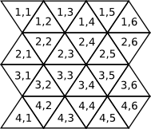
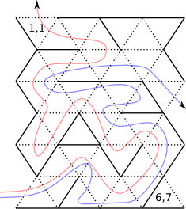

# Maze Pathfinding Program

## Project Description

This project aims to develop a program that navigates through a maze from an entrance to an exit. The maze is represented as a map of triangular cells stored in a text file. The program will compute and output the coordinates of the maze cells that form the path from the entrance to the exit.

### Implementation Details

- **Source File:** The program is implemented in a single source file named `maze.c`.
- **Maze Map:** The maze is provided as a text file, where each cell is described by a numeric value representing its boundaries.
- **Pathfinding Algorithms:**
  - **Right-Hand Rule:** Follows the right-hand rule to find a path through the maze.
  - **Left-Hand Rule:** Uses the left-hand rule to navigate through the maze.
  - **A* Algorithm (Shortest Path):** Implements the A* algorithm to find the shortest path from the entrance to the exit.
- **Output:** The path will be printed as a sequence of coordinates (row, column) where each coordinate represents a cell on the path.

### Execution

The program can be executed with the following commands:
- Display help information:

./maze --help

- Test the validity of the maze map:

./maze --test file.txt

- Find a path using the right-hand rule:

./maze --rpath R C file.txt

- Find a path using the left-hand rule:

./maze --lpath R C file.txt

- Find the shortest path using the A* algorithm:

./maze --shortest R C file.txt

### Example Output

Here is an example of how the program's output will look when finding a path through the maze:

6,1
6,2
5,2
5,3
5,4
6,4
6,3
6,4
6,5
6,6
5,6
5,7
4,7
4,6
4,5
4,4
3,4
3,5
3,6
3,5
3,4
3,3
3,2
3,1
2,1
2,2
2,3
2,4
2,5
2,6
2,7
3,7

### Visual Representation

To provide a visual understanding of the maze and the path:

- **Maze Map:**
  {: style="background-color: white"}
- **Path Map:**
  {: style="background-color: white"}

Refer to the images for a visual representation of the maze and the computed path.

The blue path represents using the right-hand rule, while the red path represents using the left-hand rule, respectively.

### Notes

- Ensure that the maze map in the text file is properly formatted and valid.
- The maze is defined by triangular cells, with each cell having boundaries that determine whether they are passable or blocked.

Feel free to reach out with any questions or issues regarding the maze pathfinding program.

